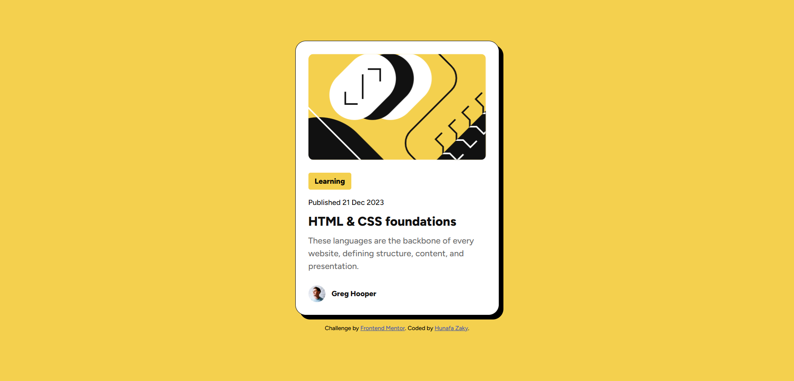

# Frontend Mentor - Blog preview card solution

This is a solution to the [Blog preview card challenge on Frontend Mentor](https://www.frontendmentor.io/challenges/blog-preview-card-ckPaj01IcS). Frontend Mentor challenges help you improve your coding skills by building realistic projects.

## Table of contents

- [Overview](#overview)
  - [Screenshot](#screenshot)
  - [Links](#links)
- [My process](#my-process)
  - [Built with](#built-with)
  - [What I learned](#what-i-learned)
  - [AI Collaboration](#ai-collaboration)
- [Author](#author)

## Overview

### Screenshot

### Links

- Solution URL: [github.com/hunafazaky/blog-preview-card](https://github.com/hunafazaky/blog-preview-card)
- Live Site URL: [hunafazaky.github.io/blog-preview-card](https://hunafazaky.github.io/blog-preview-card)

## My process

### Built with

- Semantic HTML5 markup
- CSS custom properties
- Flexbox
- Mobile-first workflow
- Local `@font-face` declarations (Figtree, self-hosted)

### What I learned

The post title is wrapped in a real `<a>` inside the `<h1>`, rather than
styling a plain `
` to merely look interactive — the design's hover
state needs a matching `:focus-visible` state for keyboard users, which
only works on an actual focusable element.

### AI Collaboration

- Tool used: Claude
- How it was used: reviewed the finished solution for bugs and anti-patterns, and reorganized the project into a flat file structure.
- Issues found and fixed: the page linked Google Fonts' "Outfit" family even though the markup and `@font-face` rules use the local "Figtree" files; the post title had a hover style but wasn't a link or heading, so it wasn't keyboard-focusable and wasn't marked up as the card's main heading; the attribution footer had CSS but no matching HTML element; and an unused italic variable-width font file shipped without ever being referenced in the CSS.

## Author

- Website - [Hunafa Zaky](https://hunafazaky.github.io/)
- Frontend Mentor - [@hunafazaky](https://www.frontendmentor.io/profile/hunafazaky)
